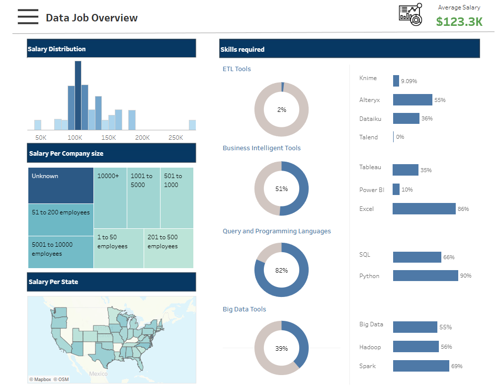
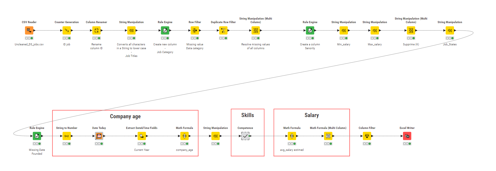

# Analyse du Marché de l'Emploi dans le domaine des données

## Introduction
Ce document offre une analyse détaillée du marché de l'emploi dans le domaine des données, basée sur un tableau de bord Tableau créé à partir des données de Glassdoor sur les offres d'emploi. L'analyse explore les distributions de salaires, les compétences requises, ainsi que l'impact de divers facteurs tels que la taille de l'entreprise, le secteur et l'industrie sur les rôles et les salaires des emplois.

## Source des données
Le jeu de données utilisé pour cette analyse provient de Kaggle: https://www.kaggle.com/datasets/rashikrahmanpritom/data-science-job-posting-on-glassdoor.

## Data Cleaning

## Fonctionnalités Clés
- **Distribution des Salaires** : Explorez comment les salaires sont répartis entre différents rôles dans le domaine des données.
- **Salaire par Taille d'Entreprise** : Comprenez les tendances salariales en fonction de la taille de l'entreprise employeuse.
- **Salaire par État** : Visualisez les différences de salaire à travers différents États des États-Unis.
- **Compétences Requises** : Identifiez les compétences essentielles classées en Outils ETL, Outils de Business Intelligence, Langages de Requête et de Programmation, et Outils Big Data.
- **Salaire Moyen** : Découvrez le salaire moyen pour les emplois liés aux données.
- **Analyse par Filtres** : Insights basés sur la catégorie de poste, la taille de l'entreprise, le secteur et l'industrie.

## Insights du Tableau de Bord
### Distribution des Salaires
- La majorité des salaires se concentrent autour de la marque des 100 000 $.
- On observe une diminution notable au-dessus de 150 000$, avec quelques postes dépassant les 200 000$.
- La majorité des professionnels de ce domaine peuvent s'attendre à gagner entre 75 000$ et 125 000$.

### Salaire par Taille d'Entreprise
- Les grandes entreprises ont tendance à offrir des salaires plus élevés, reflétant leurs ressources et leur capacité à attirer et à retenir les meilleurs talents.

### Salaire par État
- États à Salaires Élevés : La Californie, New York et Washington offrent des salaires moyens plus élevés, souvent au-dessus de la médiane nationale. Ces États sont connus pour leurs pôles technologiques.
- États à Salaires Modérés : Des États comme le Texas  et le Massachusetts montrent également des salaires compétitifs en raison de leurs industries technologiques en croissance.
- États à Salaires Inférieurs : Les États du Midwest et du Sud offrent généralement des salaires plus bas, reflétant un coût de la vie inférieur et une demande variable pour les professionnels des données par rapport les grands centres technologiques comme la Silicon Valley at California or Seattle at Washington or Boston at Massachusetts.

=> La localisation géographique joue un rôle significatif dans les niveaux de salaire, les États côtiers et technologiquement centrés offrant les salaires les plus élevés.

### Salaire par Catégories de Travail
- Data Scientist : Offre des salaires plus élevés en raison de compétences analytiques avancées et de la demande.
- Data Engineer : Salaires compétitifs, légèrement inférieurs à ceux des Data Scientists.
- Data Analyst : Salaires plus bas à ceux des Data Scientists mais toujours lucratifs, essentiels pour que les entreprises prennent des décisions basées sur les données.

### Compétences Requises
- Data Scientist
Les Data Scientists doivent avoir une solide base en programmation (en particulier Python) et en interrogation de bases de données , et en visualisation de données. Une connaissance avancée du machine learning est également critique.

- Data Engineer
Les Data Engineers nécessitent une expertise dans les outils de big data comme Hadoop et Spark (80%) , SQL et Python sont également crucial pour diverses tâches d'ingénierie des données.

- Data Analyst
Les Data Analysts doivent avoir de solides compétences en Excel et SQL pour la gestion et l'analyse des données. La maîtrise des outils de visualisation des données comme Tableau et Power BI est également précieuse.

- Business Analyst
Les Business Analysts doivent exceller en Excel et SQL pour analyser et extraire des données, et être compétents en visualisation des données avec des outils comme Power BI et Tableau. De solides compétences en communication sont également cruciales pour traduire les données en recommandations d'affaires.

- Machine Learning Engineers
 Les Machine Learning Engineers doivent avoir de solides compétences en programmation (surtout en Python), une expérience avec les outils de big data (comme Spark et Hadoop), et une maîtrise des frameworks de machine learning.

